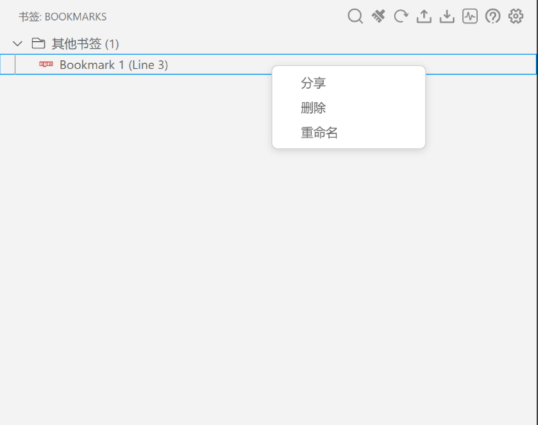

# Bookmark Extension 

[](https://code.visualstudio.com/)
[](https://marketplace.visualstudio.com/items?itemName=Vogadero.bookmark)
[](https://marketplace.visualstudio.com/items?itemName=Vogadero.bookmark)
[](LICENSE)

📌 专业的代码书签管理工具 | 支持可视化关系图 | 跨工作区同步 | 数据加密



## 简介

`Bookmark` 是一个简单的代码书签扩展，允许用户通过行标记来添加和清除书签，方便快速定位代码中的重要位置。

## 🌍 多语言支持
本扩展目前支持以下语言：
- 简体中文 (默认)
- English ([帮助翻译](https://github.com/Vogadero/my-bookmark/Bookmark/issues/12))

切换语言方式：
```json
// 在 VS Code 设置中修改
{
  "locale": "en" 
}
```

## ✨ 核心功能

### 基础操作
- **行级书签管理**
  - `Ctrl+Alt+K` 添加当前行书签
  - `Ctrl+Alt+D` 删除当前行书签
  - `Ctrl+Alt+L` 清除所有书签
- **快速导航**
  - `Ctrl+Alt+N` 下一个书签
  - `Ctrl+Alt+P` 上一个书签

### 高级功能
- **可视化关系图**（通过命令面板 `Show Graph` 触发）
  - 支持力导向/环形/层级布局
  - 可调节节点大小和连线透明度
- **数据管理**
  - 导出为 Markdown/JSON/CSV
  - 导入外部书签数据
  - AES-256 加密存储（需在设置中启用）

## 🛠️ 安装指南

### 市场安装
1. 打开 VS Code (`Ctrl+Shift+X` 打开扩展面板)
2. 搜索 `Bookmark by Vogadero`
3. 点击安装按钮

### 手动安装
```bash
git clone https://github.com/Vogadero/Bookmark.git
cd Bookmark
npm install
npm run package
code --install-extension ./bookmark-1.0.0.vsix
```

## ⚙️ 配置示例
```json
// settings.json
{
  "bookmark.storageMode": "workspace", // 存储模式 [global/workspace]
  "bookmark.graphSettings.layout": "force", // 布局算法 [force/circular/hierarchy]
  "bookmark.enableEncryption": true, // 启用数据加密
  "bookmark.highlightDuration": 3000 // 高亮持续时间(ms)
}
```

## ⌨️ 快捷键对照表

| 功能         | 快捷键       | 对应命令             |
| ------------ | ------------ | -------------------- |
| 添加书签     | `Ctrl+Alt+K` | `bookmark.add`       |
| 删除书签     | `Ctrl+Alt+D` | `bookmark.remove`    |
| 清除所有书签 | `Ctrl+Alt+L` | `bookmark.clearAll`  |
| 下一个书签   | `Ctrl+Alt+N` | `bookmark.next`      |
| 上一个书签   | `Ctrl+Alt+P` | `bookmark.previous`  |
| 显示关系图   | -            | `bookmark.showGraph` |
| 导出书签     | -            | `bookmark.export`    |
| 导入书签     | -            | `bookmark.import`    |

## 🤝 参与贡献
欢迎通过以下方式参与改进：

1. 提交问题报告 Issues

2. 创建功能分支：

   ```bash
   git checkout -b feature/your-feature
   ```

3. 提交规范的 commit 消息：

   ```bash
   git commit -m "feat: add new graph layout"
   ```

4. 推送分支并创建 Pull Request

5. 代码规范

   请先阅读[贡献指南]((https://github.com/Vogadero/my-bookmark/blob/master/CONTRIBUTING.md))，主要规范包括：

   - 代码规范

     ```bash
     # 提交前必须通过代码检查
     npm run lint
     
     # 测试要求
     npm test
     ```

   - 提交规范

     - 使用 [Conventional Commits](https://www.conventionalcommits.org/) 格式

     - 示例：

       ```bash
       git commit -m "feat: add i18n support"
       git commit -m "fix: resolve memory leak in graph module"
       ```

   - 翻译贡献

     - 复制 `package.nls.json` 为 `package.nls.xx.json`
     - 翻译所有 `%xxx%` 字段
     - 提交 Pull Request

     ```bash
     git clone git@github.com:Vogadero/Bookmark.git
     cd Bookmark
     npm install
     npm run dev  # 启动开发模式
     ```

## 📜 许可证协议

本项目采用 MIT 开源协议，允许：

- 商业用途
- 修改和分发
- 私用
- 附加条款参见许可证文件

## 📮 技术支持

获取帮助的途径：

1. 📚 [官方文档](https://vogadero.github.io/Bookmark/)
2. 🐛 [问题追踪系统](https://github.com/Vogadero/my-bookmark/Bookmark/issues)
3. 📧 开发者邮箱：[994019222@qq.com](mailto:994019222@qq.com)、[15732651140@163.com](mailto:15732651140@163.com)
4. 📱 紧急联系：+86 157-3265-1140

<sub>🔄 最新更新：2024-02-27 | 🔧 维护团队：Vogadero </sub>